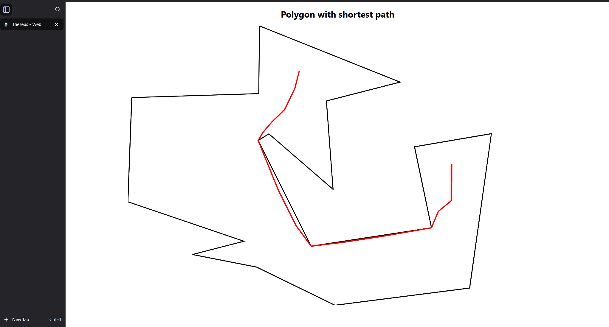
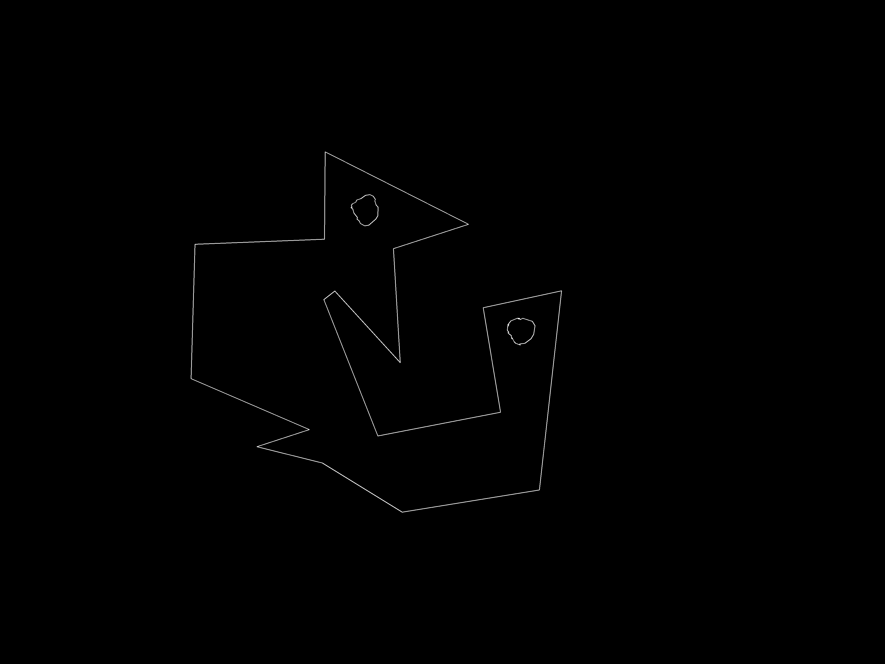
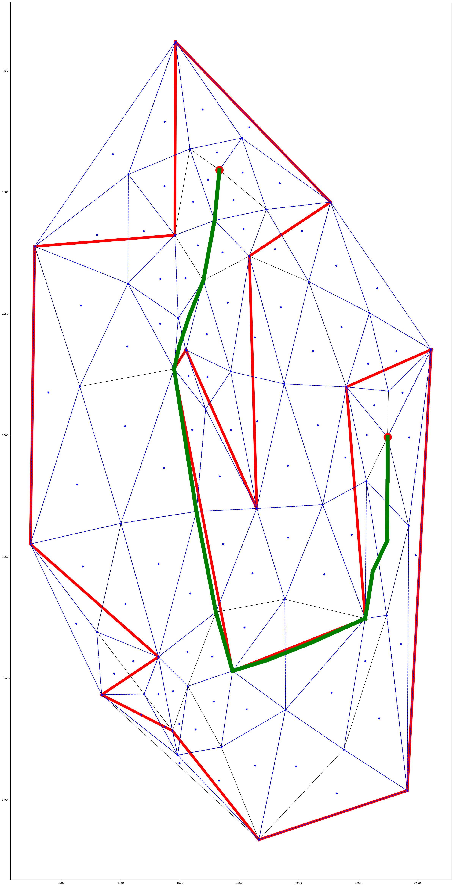
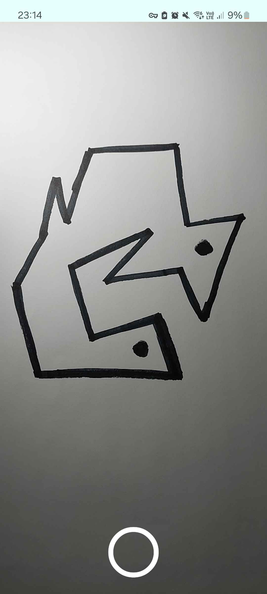
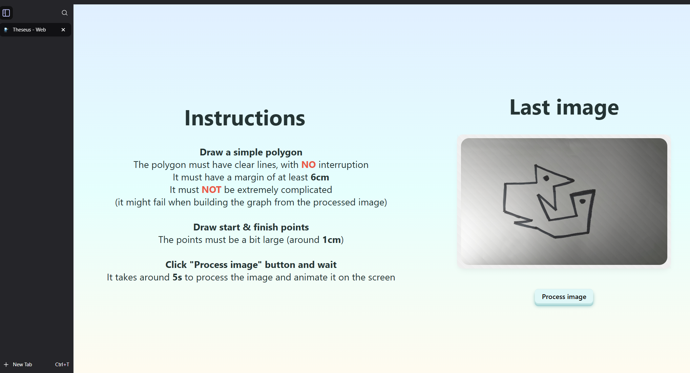

# Theseus

**Theseus** is a mobile & web application developed to compute the shortest path in a polygon and visual represent it on the web.

## Polygon with shortest path on web

## Raw image of polygon

## Polygon outline

## Matplotlib polygon with triangulation andshortest path representation

## Mobile view

## Web view

## Flow

- Draw on a paper a simple polygon
- Place the phone above a paper
- Take picture and send image to firebase
- Process image from firebase (opencv) then compute the graph
- Use Dijsktra to compute the shortest path
- Represent visually the shortest path on the web using D3.js

Note: This is a simple representation of the app's flow

## Technical details

- Mobile: **React Native**
- Database: **Firebase**
- Web client: **React**
- Web server: **Express**

- Image processing: Python, **OpenCV**
- Graph computation: Python (**scipy, shapely, matplotlib**)
- Triangulation: **Delaunay's** algorithm for triangulation
- Path computation: **Dijkstra's** shortest path algorithm
- Graph representation: **D3.js**

### Reference

The project's name is a Greek mythology reference to the labyrinth in which [Theseus](https://en.wikipedia.org/wiki/Theseus) fought the Minotaur.
